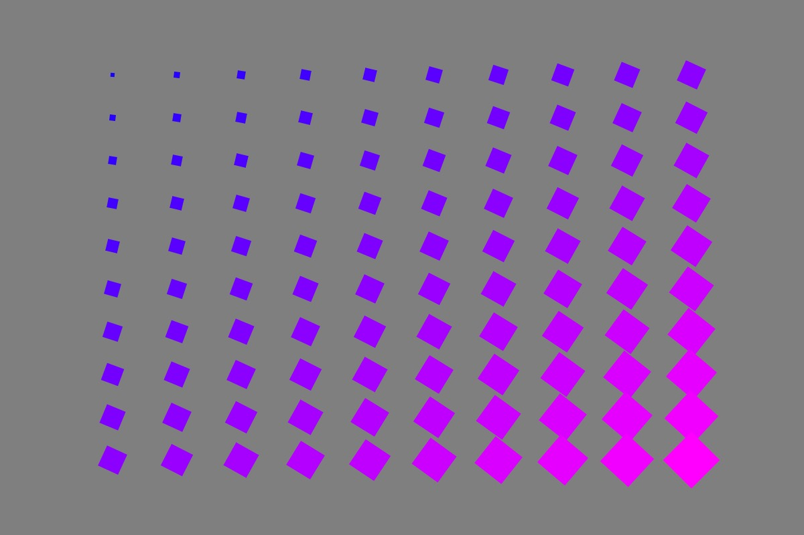

# Week 2 — Hello p5

<!--REPLACE SKETCHES-->

## [Hello P5](sketch1)

## [Rows and Columns](sketch2)

## [Faces](sketch3)

## [Drawing](sketch4)

## [Drawing / Velocity](sketch5)

## [Drawing / Lines](sketch6)

## [Color Lerping](sketch7)

## [Lerping / Sine Waves](sketch8)

<!--REPLACE SKETCHES-->
