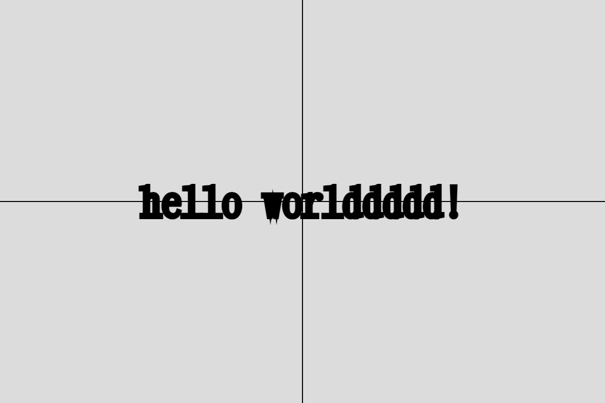
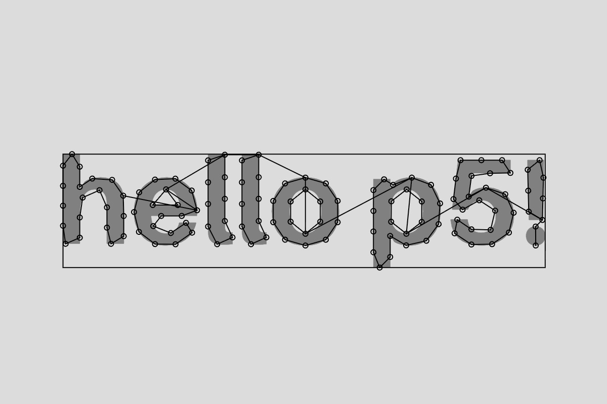

# Week 3 — Typography

<!--REPLACE SKETCHES-->

## [Fonts / Hello](sketch1)

## [Fonts / Datavis](sketch2)

<video src="sketch2/thumbnail.mp4" width="100%" controls loop></video>

## [Fonts / Drawing](sketch3)

<video src="sketch3/thumbnail.mp4" width="100%" controls loop></video>

## [Text Points](sketch4)

## [Text Points / Social Distancing](sketch5)

<video src="sketch5/thumbnail.mp4" width="100%" controls loop></video>

## [Text Points / Glyphs](sketch6)

<video src="sketch6/thumbnail.mp4" width="100%" controls loop></video>

## [Text Points / Indices](sketch7)

<video src="sketch7/thumbnail.mp4" width="100%" controls loop></video>

## [Text Points / Stretching](sketch8)

<video src="sketch8/thumbnail.mp4" width="100%" controls loop></video>

<!--REPLACE SKETCHES-->
