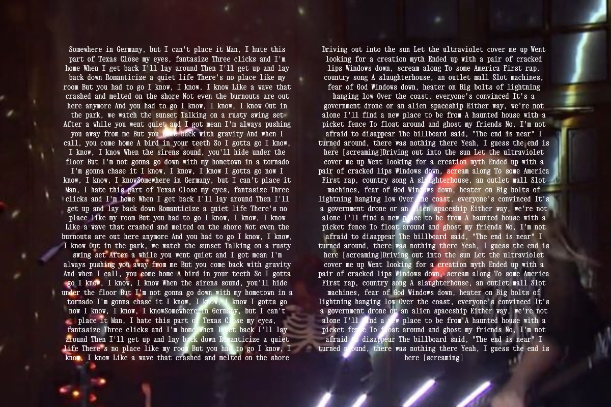
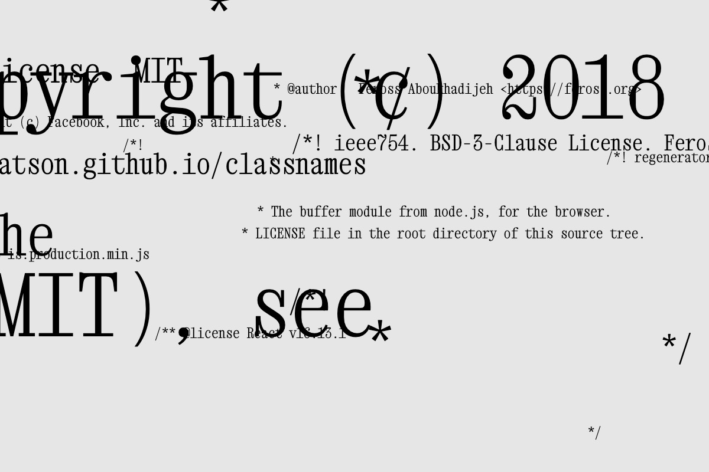

# Week 4 — Macrotypography and OOP

<!--REPLACE SKETCHES-->

## [Coding Agents](sketch-agent)

## [Images & Macrotypography](sketch1)

## [Macrotypography / Load Strings](sketch2)

## [Macrotypography / Parallax](sketch3)

## [Macrotypography / Grids](sketch4)

## [OOP / Forces](sketch5)

## [OOP / Forces 2](sketch6)

## [Macrotypography / Typing](sketch7)

## [Macrotypography / Parallax + Typing](sketch8)

<!--REPLACE SKETCHES-->
