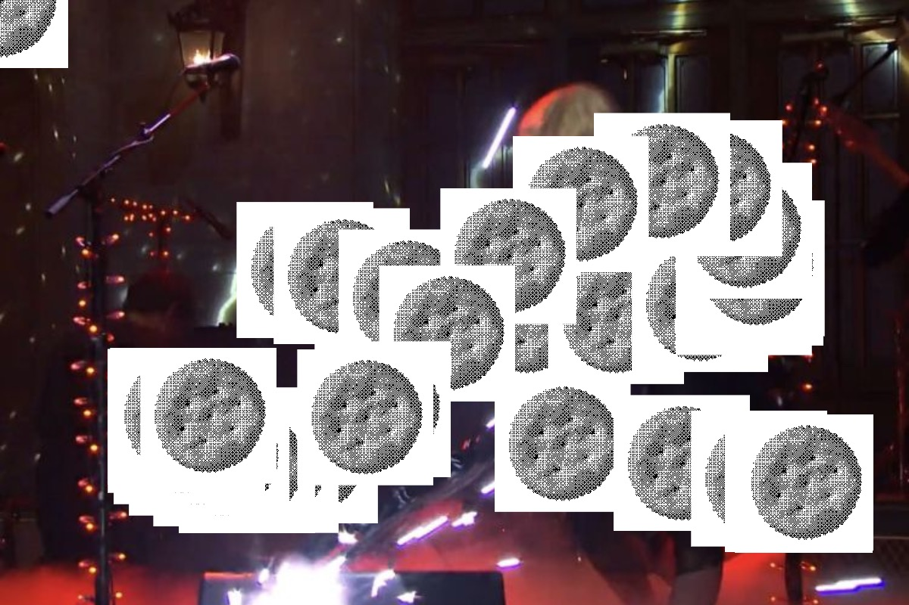
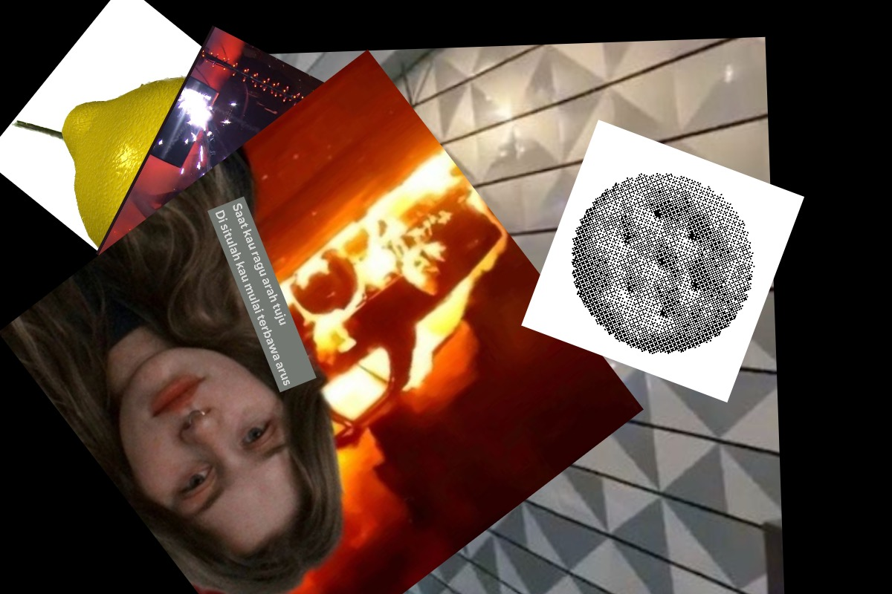
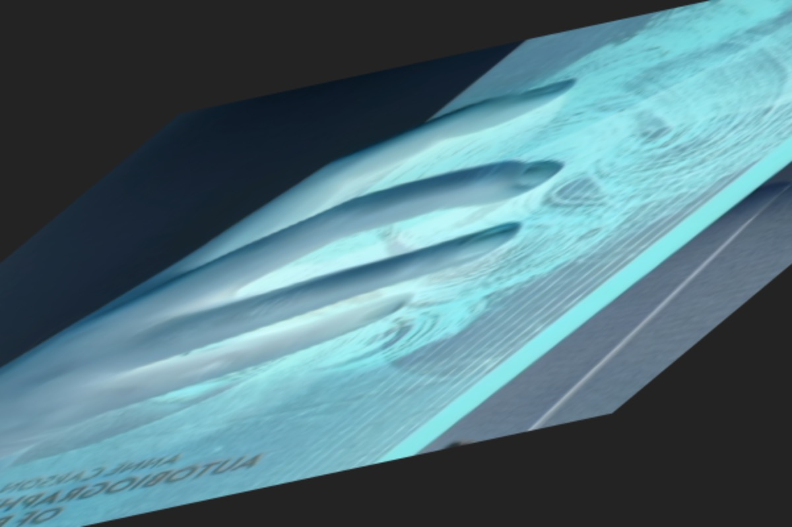
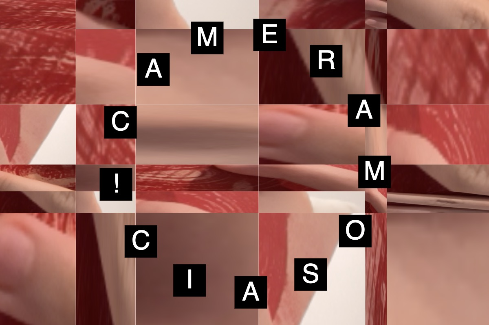

# Week 5 — Images and Video

<!--REPLACE SKETCHES-->

## [Images](sketch1)

## [Images / Cursors](sketch2)

## [Images / Collage](sketch3)

## [Hello Camera](sketch4)

## [Camera Mosaic](sketch5)

## [Video Processing](sketch6)

## [Video / ASCII](sketch7)

## [Video Processing / Mosaic](sketch8)

<!--REPLACE SKETCHES-->
