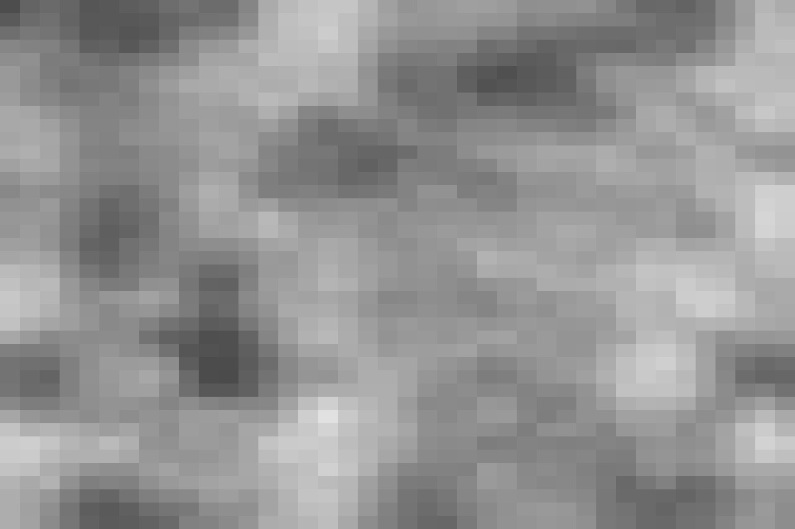

# Week 6 — Randomness and Noise

<!--REPLACE SKETCHES-->

## [Randomness / Starry Skies](sketch1)

<video src="sketch1/thumbnail.mp4" width="100%" controls loop></video>

## [Randomness / Starry Skies 2](sketch2)

<video src="sketch2/thumbnail.mp4" width="100%" controls loop></video>

## [Randomness / Glitch](sketch3)

<video src="sketch3/thumbnail.mp4" width="100%" controls loop></video>

## [Randomness / Fragmentation](sketch3-1)

<video src="sketch3-1/thumbnail.mp4" width="100%" controls loop></video>

## [Perlin Noise](sketch4)

## [Perlin Noise / ADGIDW25 Identity](sketch4-1)

## [Perlin Noise + Glitching](sketch4-2)

<video src="sketch4-2/thumbnail.mp4" width="100%" controls loop></video>

## [Glitchy Title](sketch5)

<video src="sketch5/thumbnail.mp4" width="100%" controls loop></video>

<!--REPLACE SKETCHES-->
