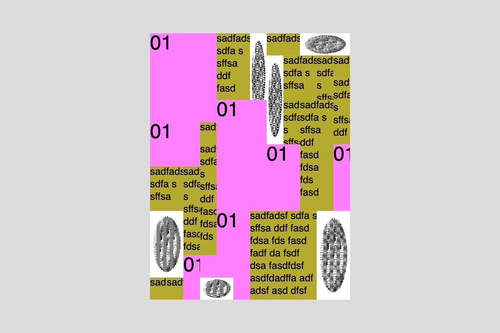

# Week 4 — Macrotypography and OOP

<!--REPLACE SKETCHES-->

## [Coding Agents](sketch-agent)

<video width="600" height="400" src="sketch-agent/thumbnail.mp4" controls></video>

## [Images & Macrotypography](sketch1)

## [Macrotypography / Load Strings](sketch2)

## [Macrotypography / Parallax](sketch3)

<video width="600" height="400" src="sketch3/thumbnail.mp4" controls></video>

## [Macrotypography / Grids](sketch4)

## [OOP / Forces](sketch5)

<video width="600" height="400" src="sketch5/thumbnail.mp4" controls></video>

## [OOP / Forces 2](sketch6)

<video width="600" height="400" src="sketch6/thumbnail.mp4" controls></video>

## [Macrotypography / Typing](sketch7)

<video width="600" height="400" src="sketch7/thumbnail.mp4" controls></video>

## [Macrotypography / Parallax + Typing](sketch8)

<video width="600" height="400" src="sketch8/thumbnail.mp4" controls></video>

<!--REPLACE SKETCHES-->
