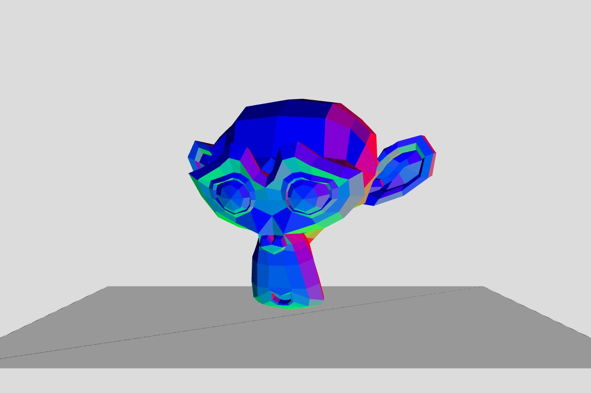

# Week 7 — 3D and Sound

<!--REPLACE SKETCHES-->

## [3D / Primitives](sketch1)

<video src="sketch1/thumbnail.mp4" controls loop></video>

## [3D / Camera Movement](sketch1-2)

<video src="sketch1-2/thumbnail.mp4" controls loop></video>

## [3D / Models](sketch1-3)

## [3D / Lighting](sketch1-4)

## [3D / Texture + Materials](sketch1-5)

## [Sounds / "Jacob Collier Simulator"](sketch2)

<video src="sketch2/thumbnail.mp4" controls loop></video>

## [Sounds / Beeping](sketch2-2)

<!--REPLACE SKETCHES-->
